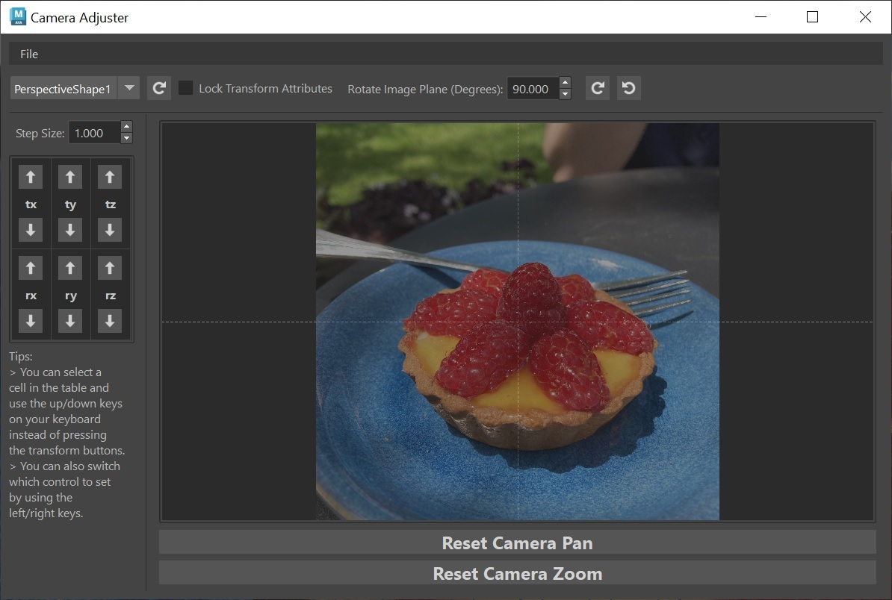

# Camera Adjuster Tool

Author: Eric Hug 



## Requirements
* Maya 2022 (with python 3) through 2024

## Installation
* Place downloaded folder into your local "maya/scripts" folder.
* Open Maya.
* Open Maya's Script Editor. In a Python tab, run the tool using the following python code:
```python
from importlib import reload
from camera_adjuster import view
reload(view)
view.start_up()
```

## Usage
### Export
* **Step 1:** Create an image plane that is parented under your current camera.
* **Step 2:** Load the tool.
* **Step 3:** When you start blocking out your mesh, you can use the translate and rotate controls within this tool to position your camera so that your mesh is lined up with your image plane's perspective.
* **Step 4:** When getting into details for your mesh, you can zoom in on your image plane by hovering over the image displayed in the tool and using your mouse wheel. You can also move/pan the image plane around by clicking and dragging the image around within the tool.

